# Minimal Compute Shader Examples
Minimal test scenes contains compute shaders, compute buffers etc
Playing with the transport between CPU <-> GPU

Unity version : 2023.3.0a13+, contains both `BuiltinRP` and `Universal Render Pipeline (URP)` scenes \
See branches for older Unity versions \
Tested with : Win DX11

| Scene | Image | Description |
| --- | --- | --- |
| 🔷 **01_Compute_Texture** 🔷 | |
| `01_1_Basic` | 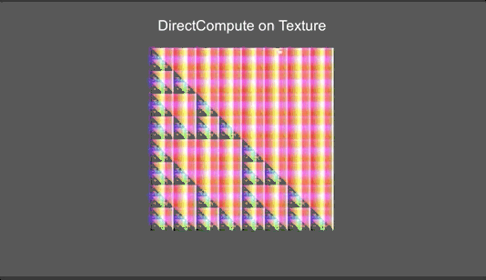 | The most basic one, edit texture with compute shader, shader takes the texture for rendering |
| `01_2_FallingSand` |  | Example of using compute to animate texture pixels |
| `01_3_Fluid_2D` | 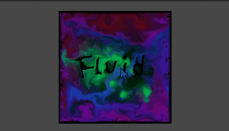 | GPU Fluid. Ref to [Scrawk/GPU-GEMS-2D-Fluid-Simulation](https://github.com/Scrawk/GPU-GEMS-2D-Fluid-Simulation) |
| `01_4_Fluid_3D` | 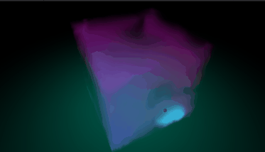 | A 3D version based on above GPU Fluid |
| 🔷 **02_StructuredBuffer** 🔷 | |
| `02_1_StructuredBufferNoCompute` |  | ComputeBuffer can also be used in Shader, not just ComputeShader. The folder contains implementation of unlit vert-frag, surface shader and unlit URP shader |
| `02_2_ComputePaintTexture` |  | Paint the texture by sending object positions to compute shader with StructuredBuffer |
| `02_3_RotatingCircles` | 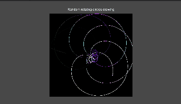 | Similar to above, just another playground scene |
| `02_4_ComputePaintTexture_DFT` | 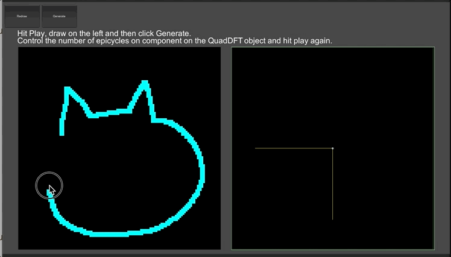 | Similar to above but drawing with Epicycles using Discrete Fourier Transform. Ref to [The Coding Train's youtube video](https://www.youtube.com/watch?v=MY4luNgGfms) |
| `02_5_ComputeParticlesDirect` |  | GPU Particle, drawing fixed no. of particles |
| `02_6_ComputeSketch` | 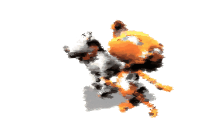 | Draw quads on the screen with color filled by compute shader |
| 🔷 **03_GPU_to_CPU** 🔷 | |
| `03_1_StructuredBufferWithCompute` |  | Another basic one, use compute to calculate some data and send back to CPU |
| `03_2_AsyncGPUReadback` |  | Similar to `StructuredBufferWithCompute`, but use AsyncGPUReadback to get array data back to CPU |
| `03_3_AsyncGPUReadbackTex` |  | Result is same as `ComputeUAVTexture`, but this scene uses AsyncGPUReadback to get texture data back to CPU, and CPU send the texture data to Shader for rendering |
| `03_4_AsyncGPUReadbackMesh` | 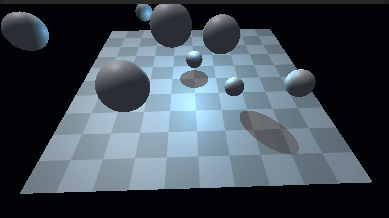 | Update mesh vertices with compute + AsyncGPUReadback to get the vertex data back to CPU for physics |
| `03_5_AsyncGPUReadbackMesh_NewMeshAPI` |  | Same as above but using the [new Mesh API](https://github.com/Unity-Technologies/MeshApiExamples) |
| 🔷 **04_Indirect** 🔷 | |
| `04_1_IndirectCompute` | 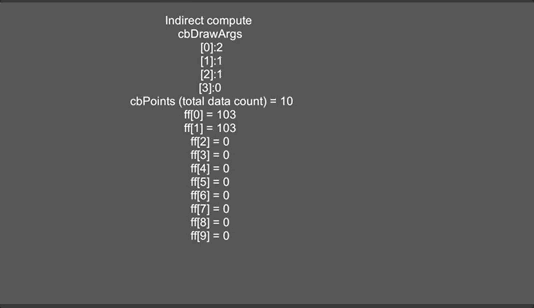 | Simple indirect compute (indirect dispatch) and CopyCount |
| `04_2_ComputeParticlesIndirect` | 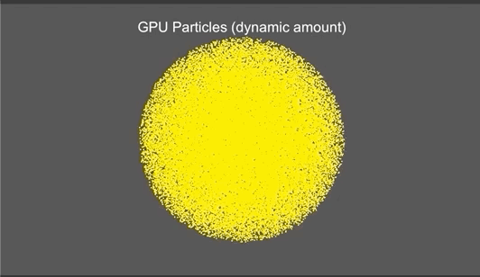 | GPU Particle, drawing dynamic no. of particles, no need to read back to CPU! |
| `04_3_ComputeParticlesIndirect_VFX` |  | Implementation of above scene with VFX graph |
| `04_4_IndirectReflectedStar` | 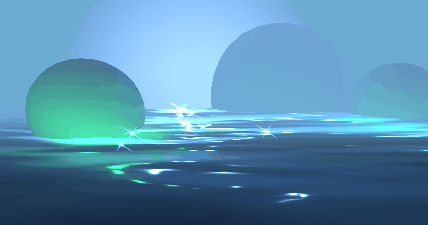 | Draw stars on the screen only if the pixels are bright enough |
| 🔷 **05_Shader_to_CPU** 🔷 | |
| `05_1_UAVInShader` | 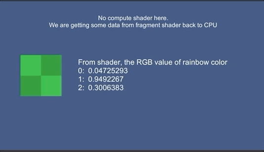 | Read some data back to CPU from fragment shader |
| 🔷 **06_Compute_Mesh** 🔷 | |
| `06_1_ComputeVertex` | 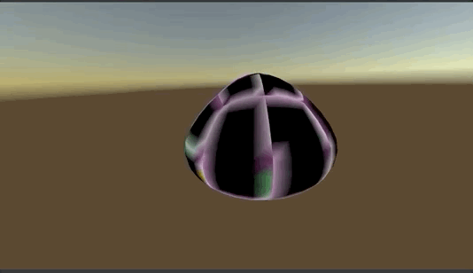 | Replace vertex buffer with StructuredBuffer and drive vertex displacement by compute |
| `06_2_ComputeVertexLit` |  | A usecase of above, with different shader passes share the same vertex data |
| `06_3_SkinnedMeshBuffer_SameMesh` |  | Blend the vertex data from 2 SkinnedMeshRenderer vertex buffer and render it with MeshRenderer |
| `06_4_SkinnedMeshBuffer_DiffMesh` |  | Similar to above but blending 2 different SkinnedMeshes. The blended triangles are drawn with DrawMeshInstancedIndirect() |
| `06_5_VFXGraphMeshDeform` | 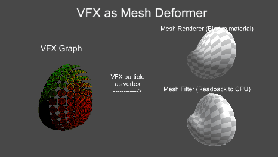 | Using VFX Graph to deforming mesh (particle as vertex) |
-------------

Disclaimer: The stuff here might not be the best practice / optimized :'(. But at least they works. Play them for fun.
