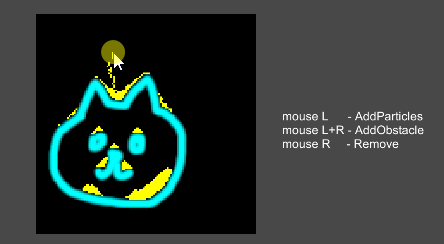
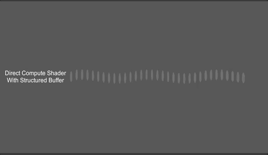
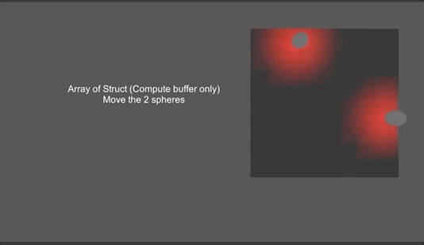
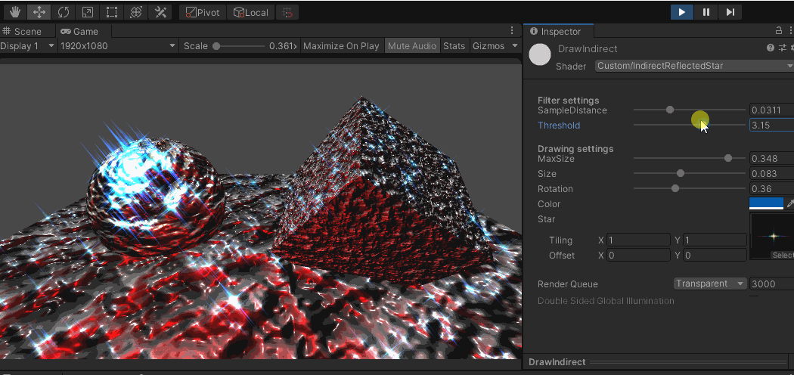
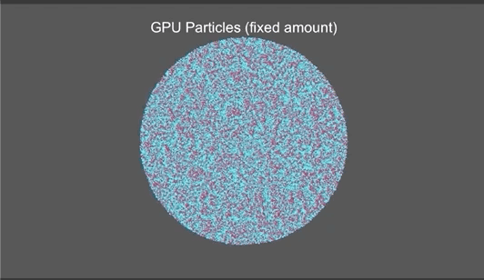
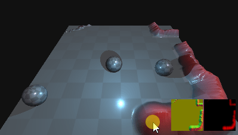
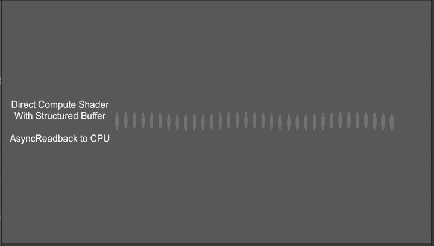

# Minimal Compute Shader Examples
Minimal test scenes contains compute shaders, compute buffers etc
Playing with the transport between CPU <-> GPU

Unity version : 2020.3+, contains both BuiltinRP and Universal RP (URP) scenes
Tested with : Win DX11

| Scene | Image | Description |
| --- | - | --- |
| `ComputeUAVTexture` |  | The most basic one, edit texture with compute shader |
| `ComputeUAVTexFlow` |  | Example of using compute to animate texture pixels |
| `StructuredBufferWithCompute` |  | Another basic one, use compute to calculate some data and send back to CPU |
| `StructuredBufferNoCompute` |  | ComputeBuffer doesn't always need to stick with ComputeShader |
| `IndirectCompute` |  | Simple indirect compute (indirect dispatch) and CopyCount |
| `IndirectReflectedStar` |  | Draw stars on the screen only if the pixels are bright enough |
| `ComputeParticlesDirect` |  | GPU Particle, drawing fixed no. of particles |
| `ComputeParticlesIndirect` |  | GPU Particle, drawing dynamic no. of particles, no need to read back to CPU! |
| `ComputeVertex` |  | Replace vertex buffer with StructuredBuffer and drive vertex displacement by compute |
| `ComputeVertexLit` |  | A usecase of ComputeVertex so that different shader passes share same vertex data |
| `UAVInShader` |  | Read some data back to CPU from fragment shader |
| `AsyncGPUReadback` |  | Similar to StructuredBufferWithCompute, but use AsyncGPUReadback to get array data back to CPU |
| `AsyncGPUReadbackTex` |  | Similar to ComputeUAVTexture, but use AsyncGPUReadback to get texture data back to CPU |
| `AsyncGPUReadbackMesh` |  | It is much faster to update mesh vertices with compute + AsyncGPUReadback to get the vertex data back to CPU for physics |

-------------

Disclaimer: The stuff here might not be the best practice / optimized :'(. But at least they works. Play them for fun.
